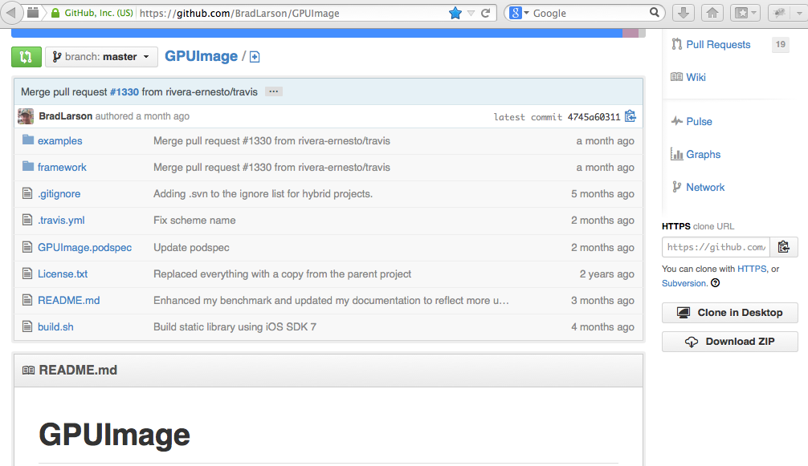
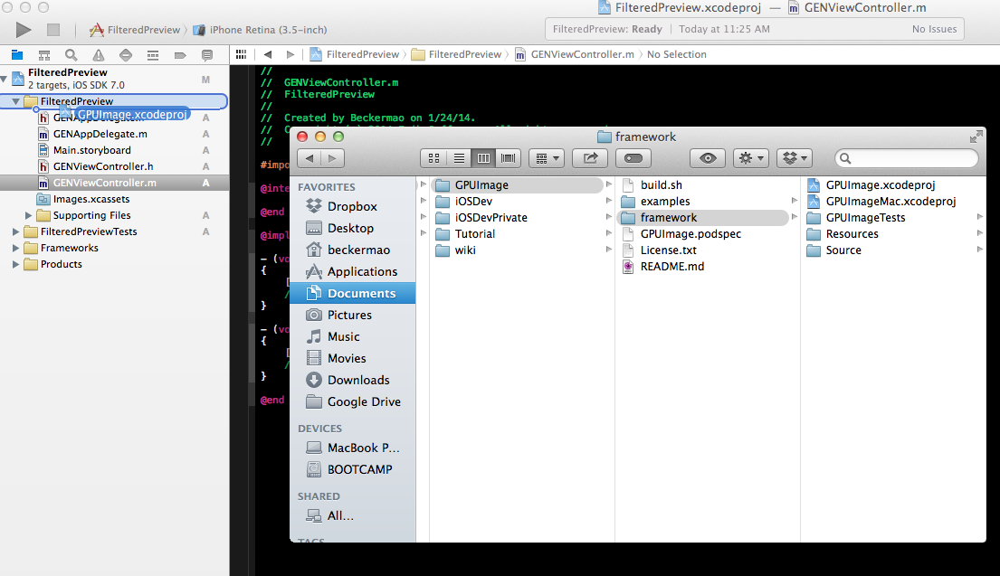
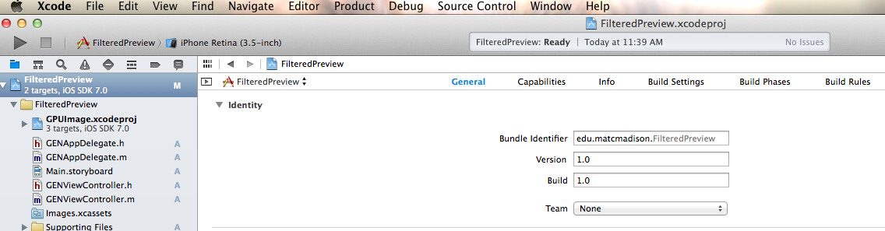
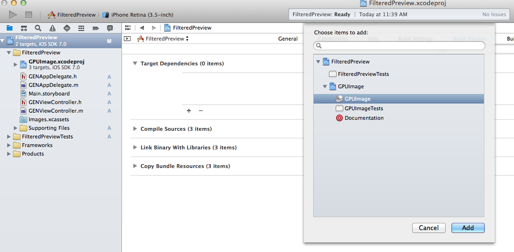
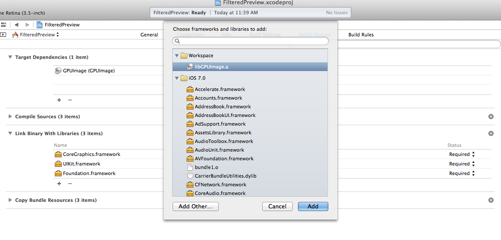
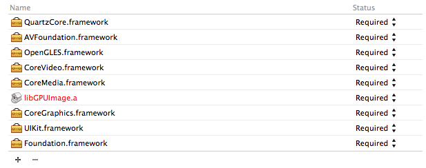
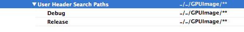
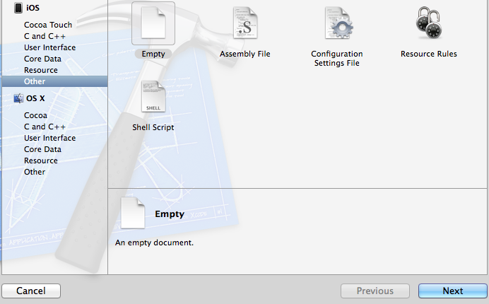
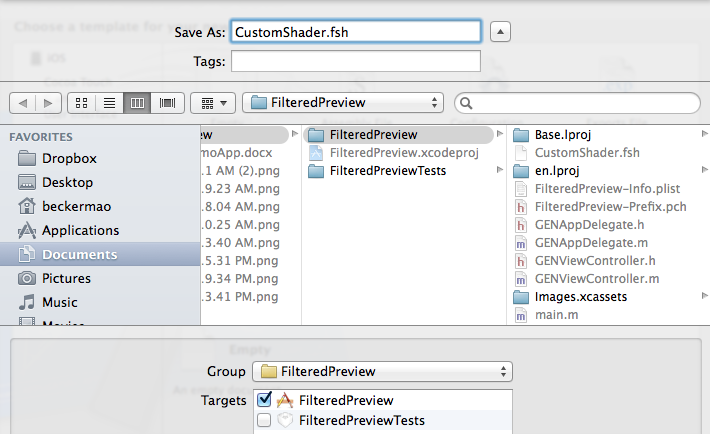
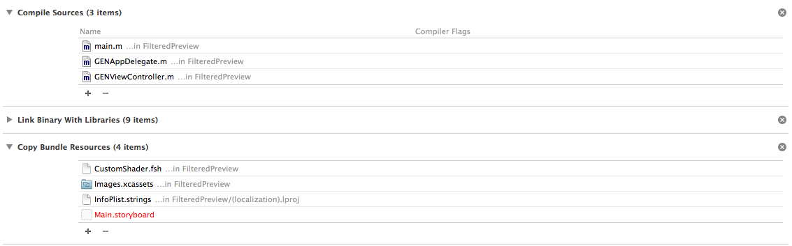

# Erik's GPUImage Tutorial

###Today we are going to learn about using the GPUImage library. The first part of the directions will focus on adding the GPUImage framework to your project. It is basically a more detailed version of Brad’s directions tailored to latest release of xcode. If you have already done this simply create a single view project named “FilteredView” and follow along as review. The completed tutorial can be found on github at https://github.com/ErikJefferson/FilteredPreview.

#### 1. First get a copy of GPUImage on to your machine. Download GPUImage from gitHub by using the link on my page. If you are comfortable pulling it down with git, copy the address and clone it. Otherwise just download it as a zip using the link on the left side of the page and then unpack it in the same directory in which you will build our demo app.

#### 2. Create a single view project named “FilteredPreview”

#### 3. Go into the GPUImage folder you pulled down from gitHub and navigate into the framework folder. From the framework folder drag the GPUImage.xcodeproj file into your project as shown.

#### 4. Now you need to add GPUImage as a target dependency on your project. This can be found under "Build Phases" in your project settings.

#### 5. Now do the same under the "Link Binary With Libraries" section of the "Build Phase" on the same tab.

#### 6. Now on the same tab or back under the general tab add the folloing libraries to your project (GPUImage is dependent on these libraries): CoreMedia, CoreVideo, OpenGLES, AVFoundation, QuartzCore. When you are done your library pane should look like this.

#### 7. Now this is the tricky part. To get this all to work properly you need to add header search paths that can find objects in the GPUImage framework. The path will be relative from the current location of your project to the location of your GPUImage framework you downloaded from gitHub. The search paths are found under "Build Settings".

#### 8. My search paths look like the picture above because my GPUImage folder was cloned and not taken from the zip (if taken from the zip the folder name will be different).  Also, the path must be recursive (have ** after it). My project is nested in my “Tutorial” folder, which is on the same level as the “GPUImage” folder. Hence “../../” to get out to that level. Your path may vary.

#### 9. That takes care of the grunt work, now lets get to working with the library. First create a property in the class interface that is a GPUImageVideoCamera. This cannot be a local variable because we need it to persist.
	@property GPUImageVideoCamera *videoCamera;

#### 10. We will then create a GPUImage view and setting up the camera. Add this to the viewDidLoad method in the ViewController:
	self.videoCamera = [[GPUImageVideoCamera alloc] initWithSessionPreset:AVCaptureSessionPreset640x480 cameraPosition:AVCaptureDevicePositionFront];
	self.videoCamera.horizontallyMirrorFrontFacingCamera = YES; 
	self.videoCamera.outputImageOrientation = UIInterfaceOrientationPortrait;

	GPUImageView *filteredVideoView = [[GPUImageView alloc] initWithFrame:CGRectMake(0.0, 0.0, self.view.bounds.size.width, self.view.bounds.size.height)];

#### 11. Now still in the viewDidLoad method, set the application view to be the one we created, send the camera to it and start the capturing video.
	self.view = filteredVideoView;
	[self.videoCamera addTarget:filteredVideoView];
	[self.videoCamera startCameraCapture];

#### 12.	We now have a working camera app that you can deploy to your devices, go ahead and try it out. It will not work on the simulator though, so deploy to your devices. Next we will add a custom filter to the video.

#### 13.	To add the custom filter to the video preview we must first code the custom filter. Filters are coded in a C like language. Let’s get started by creating a “.fsh” file. To do this create a new file and under iOS select “Other” then “Empty”

#### 14.	When you get to the save screen name the file "CustomShader.fsh" and save it to your project.

#### 15.	Now that we have the empty filter file we need to fill it with code. Write this into the “.fsh” file:
	varying highp vec2 textureCoordinate;

	uniform sampler2D inputImageTexture;

	void main()
	{
    	lowp vec3 tc = vec3(1.0, 0.0, 0.0);

    	lowp vec3 pixcol = texture2D(inputImageTexture, textureCoordinate).rgb;
    	lowp vec3 colors[3];
    	colors[0] = vec3(0.0, 1.0, 1.0);
    	colors[1] = vec3(0.0, 1.0, 0.0);
    	colors[2] = vec3(0.0, 0.0, 0.0);
    	mediump float lum = (pixcol.r + pixcol.g + pixcol.b) / 2.0;
    	int ix = (lum < 0.5)? 0:1;
    	tc = mix(colors[ix], colors[ix + 1], (lum - float(ix) * 0.5) / 0.5);

    	gl_FragColor = vec4(tc, 1.0);
	}

#### 16. Now to implement the filter. To do that we must create it. Add this code to the ViewController file above the line where you create the GPUImageView:
	GPUImageFilter *customFilter = [[GPUImageFilter alloc] initWithFragmentShaderFromFile:@"CustomShader"];

#### 17. Now change the video target and add a line of code where the filter targets the view AFTER the video target line and before you start the camera:
	[self.videoCamera addTarget:customFilter];
    [customFilter addTarget:filteredVideoView];

#### 18. At this point it would be logical to assume the application would run. It will not and you will receive a warning in xcode telling you to check dependencies. There is one last step. Again we must got to the “Build Phases” section and make one important change. Remove the shader from the “Compile Sources” list and it to the “Copy Bundle Resources” list.

#### 19. Now deploy to your device and enjoy your fun video preview app. If it does not work please do not yell at the presenter, he really does try very hard.